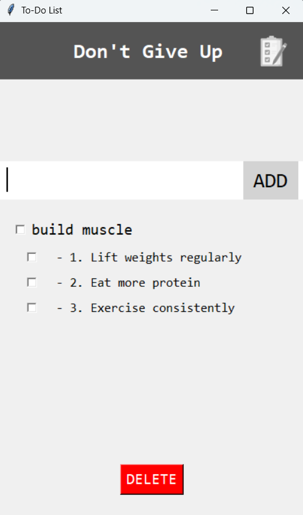

# **AI-Powered To-Do List App**  
**Task Management with GPT4All Integration**  

  

This Python-based To-Do List task manager helps you break down complex tasks into smaller actionable subtasks. Built using **Tkinter** for the GUI and **GPT4All** for AI-driven task breakdowns.

---

## **Features**  
- **AI-Generated Subtasks**: Automatically breaks down main tasks into 3 clear, actionable subtasks using GPT4All.  
- **Persistent Storage**: Saves your tasks locally, so you never lose track of your progress.  
- **Customizable**: Easily replace the GPT4All model with your preferred version.  

---

## **How It Works**  
1. Enter a main task (e.g., "Plan a vacation").  
2. The app uses GPT4All to generate 3 subtasks (e.g., "Book flights", "Choose hotel", "Create itinerary").  
3. Check off tasks as you complete them, and delete finished tasks with one click.  

---

## **Installation**  

### **Prerequisites**  
- Python 3.7 or higher  
- [Mistral-7B model file](https://gpt4all.io/index.html) (Download and place in the root folder)  

### **Steps**  
1. Clone the repository:  
    ```bash
    git clone https://github.com/yourusername/ToDoList-App.git
    cd ToDoList-App 
    ```
2. Install the required dependencies:  
    ```bash
    pip install -r requirements.txt
    ```
3. Run the application:  
    ```bash
    python todolistfinal.py
    ```

---

## **Configuration**  
If you want to use a different GPT4All model, simply replace the existing model file in the root folder and update the file path in `todolistfinal.py`.

---

## **Usage**  
1. Launch the application.  
2. Type a main task into the input field and press **Add Task**.  
3. The app will automatically generate 3 subtasks using GPT4All.  
4. Check off completed tasks and click **Delete** to remove them from the list.  

---

## **Customization and Development**  
Feel free to contribute or customize the app to fit your needs:  
- **UI Tweaks**: Modify the Tkinter interface in `todolistfinal.py`.  
- **Model Adjustments**: Update the GPT4All model or change the prompt logic for better subtask suggestions.  

To contribute:  
1. Fork the repository.  
2. Create a new branch:  
    ```bash
    git checkout -b feature-name
    ```
3. Make your changes and commit:  
    ```bash
    git commit -m "Description of changes"
    ```
4. Push to your fork and submit a pull request.  

---

## **License**  
This project is licensed under the MIT License - see the [LICENSE](LICENSE) file for details.

---

## **Contact**  
For questions, suggestions, or feedback, feel free to reach out:  
- GitHub: [dkalan17](https://github.com/dkalan17)  
- Email: [domenkalan17@gmail.com](domenkalan17@gmail.com)
